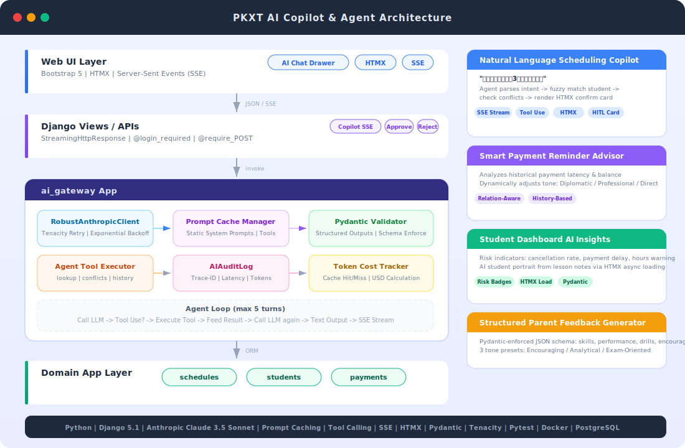

# 家教/咨询排课与收款系统 (AI Copilot & Agent Enhanced)

<p align="center">
  
</p>

本项目采用 Django 单体架构，服务于单账号场景下的家教/咨询排课、课时、收款、备注、提醒与报表管理。通过引入生产级的 **AI 智能网关**、**自然语言排课 Agent**、**智能催款话术生成器** 以及 **学员画像与风险洞察**，将传统的 CRUD 系统升级为具备现代 AI Agent 能力的智能化工作台。

---

## AI 核心亮点与技术架构

### 1. 统一 AI 智能网关 (Centralized AI Gateway)
* **Prompt Caching (提示词缓存)**：基于 Claude 3.5 Sonnet 的 Prompt Caching 机制，对静态的系统提示词和工具定义进行缓存，使 API 响应延迟降低 50% 以上，Token 成本降低高达 90%。
* **Tenacity 容错与指数退避**：集成 `tenacity` 库，实现具备随机抖动 (Jitter) 的指数退避重试机制，优雅应对网络波动与速率限制 (429)。
* **Token 级成本审计 (Token Cost Auditing)**：建立 `AIAuditLog` 数据库审计模型，实时记录每次 LLM 调用的输入、输出、缓存 Token 数及延迟，并根据 Anthropic 官方定价动态计算单次调用的预估成本 (USD)。
* **Mock 级单元测试**：使用 `pytest` 结合 `unittest.mock` 对 Anthropic 客户端进行深度 Mock，在无需消耗真实 API 额度的情况下，完整覆盖工具调用、异常重试和成本计算逻辑。

### 2. 自然语言排课助理 (AI Scheduling Copilot Agent)
* **意图与实体提取**：用户输入自然语言（例如：“帮我约下周三下午3点小明的数学课，上2个小时”），Agent 自动解析学员、时间、时长和科目。
* **多工具协同 (Tool Calling)**：Agent 拥有 `lookup_student`（模糊查询学员）、`get_student_service_plans`（获取服务方案）和 `verify_schedule_conflicts`（排课冲突校验）等工具，可自主进行多轮工具调用以补全上下文。
* **人机协同确认卡片 (Human-in-the-Loop)**：Agent 确认无冲突后，在聊天抽屉中流式渲染一个 Bootstrap 5 样式的排课确认卡片。卡片集成 **HTMX**，教师只需一键点击“确认排课”，即可通过异步 POST 请求直接写入数据库，实现零刷新交互。

### 3. 智能催款话术生成器 (Smart Payment Reminder Advisor)
* **缴费习惯画像**：通过 `get_receivable_payment_history` 工具，Agent 自动提取特定账单详情及该学员的历史收款流水，计算出平均缴费延迟天数。
* **关系感知催款话术**：Agent 根据家长的历史缴费时效自动调整语气。对于一贯准时的家长，生成极其温和、提醒为主的话术；对于经常逾期的家长，生成语气坚定、明确截止时间的話术。
* **无缝体验**：在编辑应收账款页面，针对未结清账单提供“AI 催款话术生成”一键触发按钮，自动唤起 AI 侧边栏并生成定制话术。

### 4. 学员画像与风险洞察 (Student Dashboard AI Upgrades)
* **学员风险指标**：在学员档案页侧边栏，系统自动计算并展示三大风险指标：**消课取消率**（流失风险）、**平均缴费延迟**（坏账风险）和**剩余课时预警**（续费提示）。
* **AI 异步学员画像**：利用 **HTMX** 异步加载技术，点击“生成学员画像”后，AI 智能网关会读取该学员最近 10 次的课堂备注 (`SessionNote`)，自动提炼出学习特点、知识薄弱点以及后续教学建议，生成结构化的 HTML 画像，避免阻塞页面主线程加载。

---

## 系统架构图

<p align="center">
  
</p>

---

## 环境变量配置

参考 `.env.example` 进行配置：

* `DJANGO_SECRET_KEY`: Django 密钥
* `ANTHROPIC_API_KEY`: Anthropic API 密钥（启用 AI 功能必填）
* `DJANGO_ENABLE_ONE_CLICK_LOGIN`: 是否启用本地一键登录 (1 为启用)
* `DJANGO_ALLOW_SQLITE_BOOTSTRAP`: 是否允许 SQLite 本地自检模式 (1 为允许)

---

## 本地快速启动

### 方式一：Windows 一键启动 (推荐)
双击根目录下的 `start_local.bat`，脚本会自动：
1. 设置本地自检所需环境变量。
2. 执行数据库迁移并自动创建默认账号。
3. 启动 Django 本地服务。
4. 自动在浏览器中打开登录页面。

### 方式二：命令行手动启动
```bash
# 设置环境变量
set DJANGO_SECRET_KEY=dev-secret-key
set DJANGO_ALLOW_SQLITE_BOOTSTRAP=1
set ANTHROPIC_API_KEY=your-api-key-here

# 数据库迁移与启动
python manage.py migrate
python manage.py runserver
```

* **默认登录账号**：`owner`
* **默认登录密码**：`ChangeMe123!`
* 本地自检模式下，登录页提供 **一键登录** 按钮，点击即可直接进入系统。

---

## 自动化测试

项目使用 `pytest` 进行单元测试，已完整覆盖核心业务逻辑及 AI 智能网关：

```bash
# 运行全部单元测试
python -m pytest D:\test1\pkxt\tests
```

---

## 核心管理命令

系统支持通过 Django Management Commands 定时扫描并发送提醒：

* `python manage.py scan_course_reminders`: 扫描并生成课程提醒。
* `python manage.py scan_receivable_reminders`: 扫描并生成待收款提醒。
* `python manage.py scan_all_reminders`: 扫描并生成所有提醒。

---

## 生产部署 (Docker Compose)

1. 准备好生产环境的 `.env` 配置文件。
2. 执行以下命令一键构建并启动服务：

```bash
docker compose up --build -d
```

系统将自动启动 PostgreSQL 数据库、Django 容器，自动执行数据库迁移与静态资源收集，并通过 Gunicorn + Nginx 提供高性能的反向代理服务。
